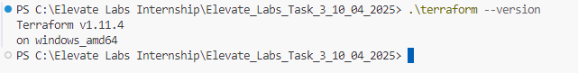
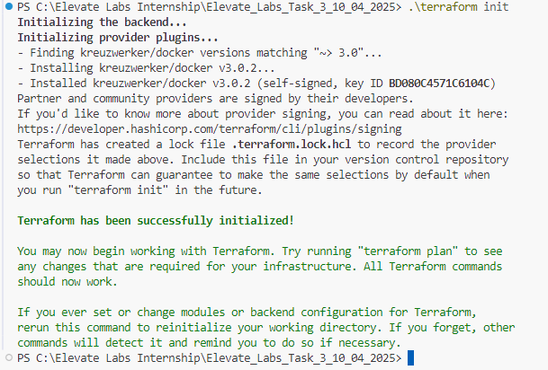
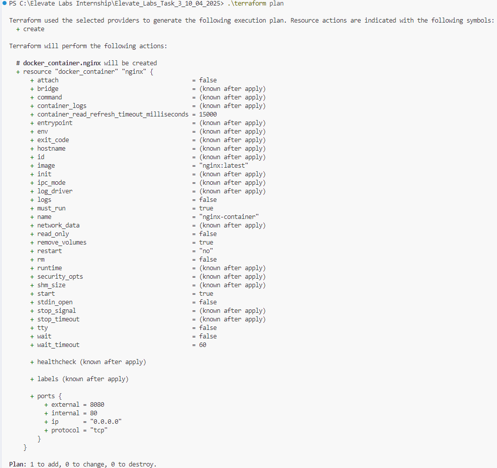
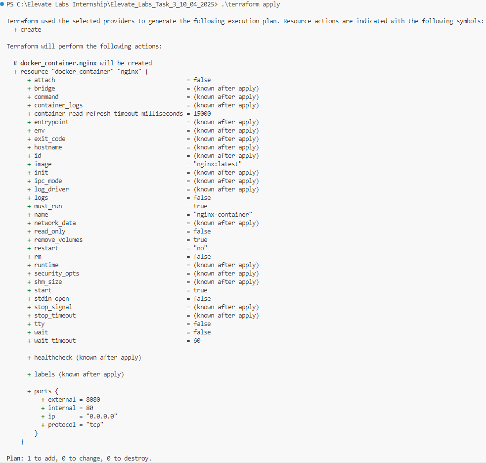
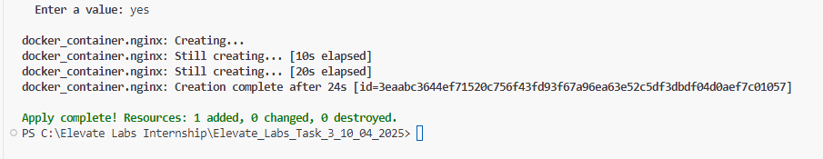
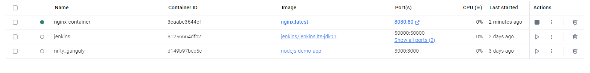
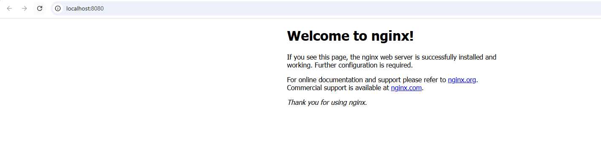
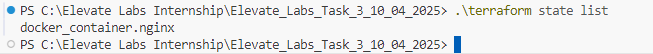
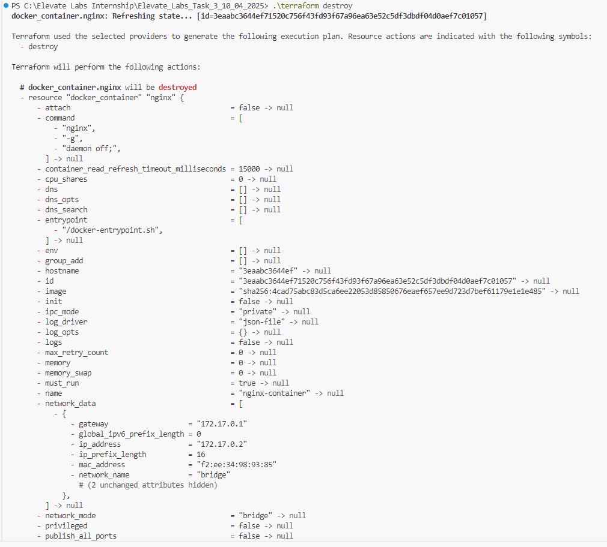
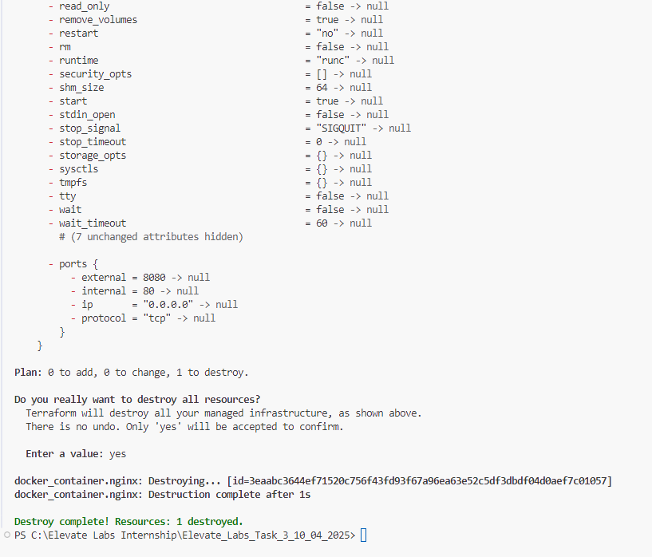

#TASK 3 : Infrastructure as Code (IaC) with Terraform

1. Install Terraform

2. Move to Working Directory Elevate_Labs_Task_3_10_04_2025
3. Create a main.tf file
4. Initialize Terraform Working Directory

5. Preview infrastructure changes

5. Apply configuration

6. Check if container running

7. Checking terraform state list

8. Terraform destroy

9. Checking logs
Elevate_Labs_Task_3_10_04_2025\execution_logs